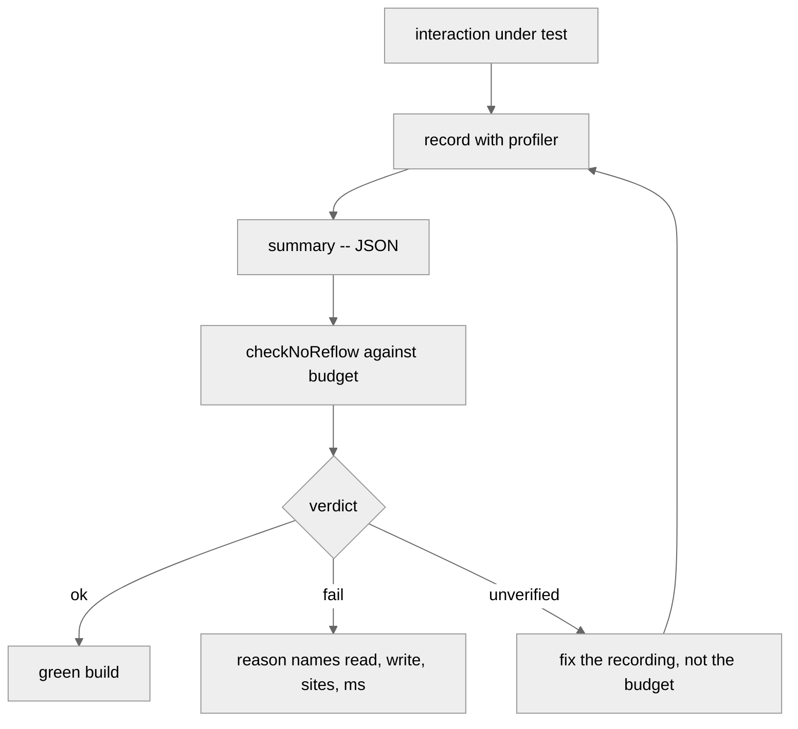

# Cookbook

The README is a reference. It answers *what does this API do?*

This is the cookbook. It answers *how do I use it for X?*

Recipes are graded in four tiers:

- **Start here (0)** -- you have installed the package and want to see a
  number, before deciding anything gates.
- **Basics (1-4)** -- your first gate, telling a thrash apart from a
  drip, adding cost, reading a verdict.
- **Working (5-11)** -- CI, allowlisting the reflows you meant to have,
  animation code, third-party libraries, headless runs, shipping a
  summary out of the browser, keeping the profiler out of its own
  numbers.
- **Pro (12-21)** -- what to do when a cost budget will not survive a
  different browser, gating a run you could only partly record, wiring
  the two profilers into one CI vocabulary, proving the detector was
  watching at all, sharing prototypes with another instrumenter, excusing
  a deliberate measurement, gating a captured report with the CLI,
  catching reflows inside an iframe, and integrating with Vue, React, and
  Angular.

Read them in order if you are new; jump around if you know what you are
looking for.

Each recipe has the same shape:

- **Goal** -- what you are trying to prove.
- **Primitive** -- which entry point.
- **Code** -- the smallest correct usage.
- **Reading the verdict** -- what each field actually means for your goal.
- **Gotchas** -- the traps I fell in first.

Everything below assumes you have run
`npm i @zakkster/lite-layout-profiler` and that the profiler is behind a
`__DEV__` flag. This library patches prototypes and allocates per
violation; it is a diagnostic tool, not a runtime dependency.

## Contents

**Diagrams**

- [The task timeline](#the-task-timeline)
- [The evidence matrix](#the-evidence-matrix)
- [The CI workflow](#the-ci-workflow)

**Recipes**

0. [Just show me a number](#recipe-0-just-show-me-a-number)
1. [My first gate](#recipe-1-my-first-gate)
2. [Telling a thrash apart from a drip](#recipe-2-telling-a-thrash-apart-from-a-drip)
3. [Gating on milliseconds, not counts](#recipe-3-gating-on-milliseconds-not-counts)
4. [Reading a verdict correctly](#recipe-4-reading-a-verdict-correctly)
5. [Allowlisting the reflows you meant to have](#recipe-5-allowlisting-the-reflows-you-meant-to-have)
6. [Silencing a third-party library](#recipe-6-silencing-a-third-party-library)
7. [Gating one interaction, not the whole page](#recipe-7-gating-one-interaction-not-the-whole-page)
8. [Running headless in CI](#recipe-8-running-headless-in-ci)
9. [Shipping a summary out of the browser](#recipe-9-shipping-a-summary-out-of-the-browser)
10. [Keeping the profiler out of its own numbers](#recipe-10-keeping-the-profiler-out-of-its-own-numbers)
11. [Finding the write, not just the read](#recipe-11-finding-the-write-not-just-the-read)
12. [Pro: cost budgets that survive a different browser](#recipe-12-pro-cost-budgets-that-survive-a-different-browser)
13. [Pro: gating a run you could only partly record](#recipe-13-pro-gating-a-run-you-could-only-partly-record)
14. [Pro: the CI-counting configuration](#recipe-14-pro-the-ci-counting-configuration)
15. [Pro: one vocabulary with lite-gc-profiler](#recipe-15-pro-one-vocabulary-with-lite-gc-profiler)
16. [Pro: proving the detector was actually watching](#recipe-16-pro-proving-the-detector-was-actually-watching)
17. [Pro: living with another instrumenter](#recipe-17-pro-living-with-another-instrumenter)
18. [Pro: allowing a deliberate measurement without hiding bugs](#recipe-18-pro-allowing-a-deliberate-measurement-without-hiding-bugs)
19. [Pro: gating a captured report in CI with the CLI](#recipe-19-pro-gating-a-captured-report-in-ci-with-the-cli)
20. [Pro: catching reflows inside an iframe](#recipe-20-pro-catching-reflows-inside-an-iframe)
21. [Integrating with Vue, React, and Angular](#recipe-21-integrating-with-vue-react-and-angular)

---

## Diagrams

### The task timeline

A forced reflow is not a property of a line of code. It is a property of
an *ordering* inside one synchronous block. The dirty flag is what makes
that ordering observable.

```mermaid
%%{init: {"theme": "neutral"}}%%
flowchart LR
    W1[write: style.width] -- sets dirty --> R1[read: offsetWidth]
    R1 -- FORCED REFLOW, timed --> C[layout recalculated, dirty cleared]
    C --> W2[write: style.height]
    W2 -- sets dirty --> R2[read: offsetHeight]
    R2 -- FORCED REFLOW, timed --> M[microtask checkpoint]
    M -- taskEpoch++ --> N[next task starts clean]
    R1:::hot
    R2:::hot
    classDef hot fill:#c41,color:#fff,stroke:#333
```



Everything between two microtask checkpoints shares a `taskId`. That is
the unit `maxPerTask` gates on, and it is the unit that matters: the
browser cannot interleave paint into the middle of a synchronous block,
so ten reflows there are ten stalls stacked into one frame.

### The evidence matrix

Not every rule can be checked from every run. A rule that cannot be
verified from the data it was handed **fails**; it never passes.

| rule | needs | unverifiable when |
| --- | --- | --- |
| *(all rules)* | a complete patch net | `patched.complete` is false |
| `maxReflows` | `summary.total` | never -- the count is exact |
| `maxPerTask` | complete records | records truncated or absent |
| `allowReads` / `allowWrites` | complete records | records truncated or absent |
| `ignoreSites` | complete records + call sites | above, or `captureStacks: false` |
| `maxCostMs` / `maxTotalCostMs` | measured costs | any counted reflow unmeasured |

`maxReflows` is the one row that survives everything, because `total` is
kept independently of the storage ring. A capped run is gateable on
volume, never on shape.

### The CI workflow

The failure path matters more than the pass path, because the failure
path is the one that has to tell a human what to change.



`verified: false` is never a reason to loosen the budget. It means the
run could not answer the question you asked, so you change how you
record, not what you demand.

---

## Recipe 0: Just show me a number

**Goal.** Find out whether the page forces layout at all, before
deciding anything.

**Primitive.** `createLayoutProfiler`.

**Code.**

```js
import { createLayoutProfiler } from '@zakkster/lite-layout-profiler';

const profiler = createLayoutProfiler();

// ... use the app for a while ...

console.table(profiler.summary().byRead);
console.log(profiler.summary().cost);
profiler.destroy();
```

**Reading the verdict.**

```js
{
    total: 47,          // exact count, even if the ring dropped records
    stored: 47,         // how many are retained in full
    truncated: false,
    taskCount: 12,      // how many distinct synchronous blocks
    cost: {
        resolutionMs: 0.1,
        measured: 44,
        unmeasured: 3,
        totalMs: 62.4,
        maxMs: 11.2,
        avgMs: 1.42,
        p99Ms: 9.8
    }
}
```

`total: 47` across `taskCount: 12` is a drip. `total: 47` across
`taskCount: 2` is a thrash. The same count means very different things,
which is Recipe 2.

**Gotchas.**

- `warnToConsole` defaults to `true` and will fill the console fast on a
  thrashing page. Turn it off once you have seen the shape.
- `total` can exceed `stored`. The count is exact; the records are
  capped at `maxStored` (default 200).

---

## Recipe 1: My first gate

**Goal.** Prove that a specific interaction forces no layout at all.

**Primitive.** `assertNoReflow`.

**Code.**

```js
import { createLayoutProfiler, assertNoReflow } from '@zakkster/lite-layout-profiler';

const profiler = createLayoutProfiler({ warnToConsole: false });

await openTheDrawer();

assertNoReflow(profiler.summary());   // default budget is zero
profiler.destroy();
```

If the interaction forces no layout, this returns a report. If it forces
any, it throws `ReflowBudgetError`:

```
[lite-layout-profiler] Reflow budget exceeded (1 rule breached):
  - maxReflows: 3 forced reflows counted, limit 0
```

**Reading the verdict.**

```js
{
    ok: false,
    verified: true,     // the run could answer the question
    total: 3,
    counted: 3,         // after allowlist exclusions -- none here
    excluded: 0,
    cost: { measured: 3, unmeasured: 0, totalMs: 4.1, maxMs: 2.2 },
    violations: [{ metric: 'maxReflows', limit: 0, actual: 3, reason: '...' }]
}
```

`verified: true` is the field to check first. `ok: false` with
`verified: true` means a real breach. `ok: false` with
`verified: false` means the run could not be judged -- see Recipe 4.

**Gotchas.**

- Zero is the default budget and it is the right starting point. Raise
  it only after you have looked at what the reflows are.
- Call `destroy()` when you are done. The profiler patches shared
  prototypes; leaving two live at once is not supported.
- `assertNoReflow` throws only on breach. A malformed rule set throws
  `TypeError` immediately, at call time, before anything is evaluated.

---

## Recipe 2: Telling a thrash apart from a drip

**Goal.** Distinguish ten reflows spread over ten frames from ten in one
block.

**Primitive.** `maxPerTask`.

**Code.**

```js
checkNoReflow(profiler.summary(), {
    maxReflows: 20,     // a drip is tolerable while you migrate
    maxPerTask: 1       // a thrash is not
});
```

**Reading the verdict.**

```
maxPerTask: task #7 forced 3 reflows in one synchronous block, limit 1
```

The reason names the task, so you can find every record sharing that
`taskId` in `summary().records` and read the loop out of the call sites.

**Gotchas.**

- `taskId` advances at the microtask checkpoint, not at the frame
  boundary. Two `await`-separated blocks in the same frame are two
  tasks. That is correct: the browser can interleave between them.
- `maxPerTask` counts *after* exclusions. An allowlisted reflow does not
  inflate the block it sits in.
- A single-task run reports `taskCount: 1`, which makes
  `maxPerTask` equal to `maxReflows`. That is not a bug, it means all
  your reflows really were in one block.

---

## Recipe 2b: Failing only the reflows that kill a frame

**Goal.** Let a migrating codebase keep some forced reflows, but fail the
build the moment one lands inside `requestAnimationFrame` -- the only
place a reflow is a guaranteed dropped frame.

**Primitive.** `maxInRaf`, with `{ phases: true }`.

**Code.**

```js
const profiler = createLayoutProfiler({ phases: true });   // opt-in

await runTheAnimation();

checkNoReflow(profiler.summary(), {
    maxReflows: 50,     // tolerate a backlog elsewhere for now
    maxInRaf: 0         // but zero during render
});
```

**Reading the verdict.**

```
maxInRaf: 2 forced reflows inside requestAnimationFrame callbacks
          (frame-killing), limit 0
```

`summary().phases` breaks the whole run down by scheduler, so you can see
where the reflows actually live before deciding what to gate:

```js
// { raf: 2, timer: 9, microtask: 0, roCallback: 0, unknown: 40, unobserved: 0 }
```

**Gotchas.**

- **`phases` is opt-in.** Without `{ phases: true }`, `maxInRaf` is
  *unverifiable*, not a pass -- you cannot claim "no reflow in rAF" if you
  never wrapped rAF. Check `report.verified`, not just `report.ok`.
- **`unknown` is honest, not a bug.** A reflow that fires outside every
  wrapped scheduler (a native event handler, a framework's own scheduler)
  is `unknown`. It is never guessed into `raf`.
- **A worker or old runtime has no rAF.** There, `phasesObserved` is
  `false` and `maxInRaf` stays unverifiable rather than falsely green.
- Wrapping schedulers touches globals the whole page shares. Use `phases`
  in tests and profiling runs, not in a build you ship.

---

## Recipe 2c: Catching a getter stuck in a loop

**Goal.** Fail a read-after-write tuple that repeats inside one block --
the `for (...) { el.style.x = ...; el.offsetWidth }` anti-pattern that
forces layout every iteration.

**Primitive.** `maxThrash` (no `phases` needed).

**Code.**

```js
checkNoReflow(profiler.summary(), {
    maxReflows: 500,    // the raw count may be large and that is fine
    maxThrash: 1        // but no single tuple may repeat in a block
});
```

**Reading the verdict.**

```
maxThrash: a read-after-write tuple repeated 1000 times in one block,
           limit 1 (read `offsetWidth` after `CSSStyleDeclaration.width =`)
```

`summary().thrash` lists every collapsed loop, worst first, so 1000
identical records become one line you can act on:

```js
summary().thrash[0];
// { read: 'offsetWidth', write: 'CSSStyleDeclaration.width =',
//   readSite: '...', count: 1000, costMs: 42.7, taskId: 3, ... }
```

**Gotchas.**

- **`summary().records` still holds all 1000.** Collapsing is a separate,
  additive `thrash` view; the raw records are what `maxReflows` counts, so
  the two rules see consistent numbers.
- **Collapsing is per task.** The same tuple recurring across frames is a
  per-frame pattern -- that is `maxPerTask`'s job, not thrash.
- **Distinct call sites do not collapse.** Two `offsetWidth` reads at
  different lines in the same loop are two tuples, each with its own count.
- `maxThrash`, like every per-record rule, is unverifiable on a truncated
  run (raise `maxStored` or shrink the workload).

---

## Recipe 3: Gating on milliseconds, not counts

**Goal.** Prove no single forced layout stalls long enough to drop a
frame.

**Primitive.** `maxCostMs` and `maxTotalCostMs`.

**Code.**

```js
checkNoReflow(profiler.summary(), {
    maxReflows: 50,        // counts are not the point here
    maxCostMs: 4,          // no single stall over 4 ms
    maxTotalCostMs: 16     // and not a whole frame's worth in total
});
```

**Reading the verdict.**

```
maxCostMs: worst single forced reflow stalled 11.240 ms, limit 4 ms
           (at layoutPass (grid.js:88:4))
```

The two budgets catch different illnesses on purpose. Fifty reflows of
0.2 ms breaches `maxTotalCostMs` while passing `maxCostMs`; one reflow
of 12 ms does the reverse. Only the second drops a frame on its own;
only the first is fixable by batching.

**Gotchas.**

- Cost is measured across the *original* getter, so it is the stall
  itself, not the profiler's bookkeeping.
- `maxCostMs: 0` is not a stricter version of `maxReflows: 0`. Anything
  measurable breaches it and anything unmeasurable makes it
  unverifiable, so it always fails. Use `maxReflows: 0` for "none at
  all".
- Cost numbers are machine-specific. Recipe 12 covers what to do about
  that.

---

## Recipe 4: Reading a verdict correctly

**Goal.** Know the difference between "you broke it" and "I could not
tell".

**Primitive.** `report.verified`.

**Code.**

```js
const report = checkNoReflow(summary, rules);

if (!report.verified) {
    // The run could not answer the question. Fix the recording.
    console.error(report.violations.map((v) => v.reason).join('\n'));
} else if (!report.ok) {
    // A real breach.
    throw new Error('reflow budget breached');
}
```

**Reading the verdict.** Three states, not two:

| `ok` | `verified` | meaning |
| --- | --- | --- |
| `true` | `true` | passed, and the evidence supported the question |
| `false` | `true` | genuinely over budget |
| `false` | `false` | the run could not be judged; the budget is untested |

An unverifiable rule always makes `ok` false. There is no state where a
rule is skipped and the run still passes -- that is the whole design.

**Gotchas.**

- The temptation on `verified: false` is to relax the budget until it
  goes green. That is the one response guaranteed to be wrong: the
  budget was never evaluated, so relaxing it changes nothing except
  your confidence.
- `violations` entries with `limit: null` are the unverifiable ones.
  Their `metric` is `records`, `ignoreSites`, or `cost`.

---

## Recipe 5: Allowlisting the reflows you meant to have

**Goal.** Measure an element once on purpose without failing the gate.

**Primitive.** `allowReads`, `allowWrites`.

**Code.**

```js
checkNoReflow(summary, {
    maxReflows: 0,
    allowReads: ['getBoundingClientRect'],       // trailing () optional
    allowWrites: ['CSSStyleDeclaration.transform']   // prefix match
});
```

**Reading the verdict.**

```js
{
    total: 5,
    counted: 1,
    excluded: 4,
    excludedBy: { reads: 3, writes: 1, sites: 0 }
}
```

`total` stays honest and the subtraction is visible. That matters when
someone reviews the budget six months later and wants to know what it is
not looking at.

**Gotchas.**

- `allowReads` is validated against `READ_NAMES`. A typo throws with a
  suggestion rather than silently matching nothing:
  `` `offsetWidht` is not a read this build can emit. Did you mean `offsetWidth`? ``
- `allowWrites` is a **prefix** match. `'CSSStyleDeclaration.'` allows
  every style write, which is almost always too broad.
- A record is excluded once even when several allowlists match it, so
  `excludedBy` sums to `excluded`.

---

## Recipe 6: Silencing a third-party library

**Goal.** Gate your own code without failing on a dependency you cannot
change.

**Primitive.** `ignoreSites`.

**Code.**

```js
checkNoReflow(summary, {
    maxReflows: 0,
    ignoreSites: ['node_modules/gsap', 'node_modules/floating-ui']
});
```

**Reading the verdict.** `excludedBy.sites` tells you how much of the
run you stopped looking at. If that number is most of the run, the
budget is decorative.

**Gotchas.**

- `ignoreSites` matches `readSite` **or** `writeSite`. A dependency that
  writes and lets your code read still gets excluded -- which may not be
  what you want, since the fix is yours.
- It needs call sites, so it is unverifiable under
  `captureStacks: false`.
- Do not confuse it with `ignorePatterns`, which is the profiler option.
  `ignorePatterns` drops the reflow at capture time so it never appears
  in `total`; `ignoreSites` excludes an already-recorded one at gate
  time and reports the subtraction. Prefer `ignoreSites` so the number
  stays honest.

---

## Recipe 7: Gating one interaction, not the whole page

**Goal.** Attribute reflows to the interaction under test, not to
startup.

**Primitive.** `reset()`.

**Code.**

```js
const profiler = createLayoutProfiler({ warnToConsole: false });

await settleTheApp();       // startup reflows are not what we are testing
profiler.reset();

await clickTheThing();
const report = checkNoReflow(profiler.summary(), { maxReflows: 0 });
```

**Reading the verdict.** After `reset()`, `total` restarts at zero and
so does `stored`. `taskId` does **not** restart -- it is monotonic for
the profiler's lifetime, so task numbers in the reason string stay
unique across resets.

**Gotchas.**

- Await a microtask checkpoint before `reset()` if the previous work
  ended mid-block, or its trailing dirty flag will follow you into the
  measured window.
- One profiler at a time. To measure two interactions independently,
  reset between them rather than creating a second instance.

---

## Recipe 8: Running headless in CI

**Goal.** Fail a pull request that introduces layout thrashing.

**Primitive.** a real browser plus `assertNoReflow`.

**Code.**

```js
// playwright, puppeteer, whatever drives a real engine
await page.addScriptTag({ type: 'module', content: `
    const { createLayoutProfiler } = await import('/node_modules/@zakkster/lite-layout-profiler/LayoutProfiler.js');
    window.__profiler = createLayoutProfiler({ warnToConsole: false });
` });

await page.click('#open-drawer');

const summary = await page.evaluate(() => window.__profiler.summary());

// back in node
import { assertNoReflow } from '@zakkster/lite-layout-profiler';
assertNoReflow(summary, { maxReflows: 0, maxPerTask: 1 });
```

**Reading the verdict.** The gate runs in node against a plain object.
It never touches the DOM, so it does not care that the browser is gone
by the time the assertion runs.

**Gotchas.**

- Use a real browser. jsdom and happy-dom do not implement layout, so
  their getters cost nothing and the per-property style setters may not
  bypass `setProperty` the way real WebIDL does. The detector still
  fires, but the cost lane measures nothing real.
- Minified bundles produce minified call sites. Run against the
  unminified build or your reasons will read `at a.b (chunk.js:1:9482)`.

---

## Recipe 9: Shipping a summary out of the browser

**Goal.** Record in one place, judge in another.

**Primitive.** `summary()` is JSON-serialisable by design.

**Code.**

```js
// in the page
navigator.sendBeacon('/reflow', JSON.stringify(profiler.summary()));

// on the server, or in CI, or in a later process
import { checkNoReflow } from '@zakkster/lite-layout-profiler';
const report = checkNoReflow(JSON.parse(body), { maxReflows: 0 });
```

**Reading the verdict.** The summary carries everything the gate needs:
counts, per-task grouping, call sites, costs, and the evidence flags
(`truncated`, `stacks`, `cost.resolutionMs`) that decide what can be
verified. Nothing about the verdict depends on the profiler still
existing.

**Gotchas.**

- Full stacks are deliberately **not** in the summary -- they dominate
  the payload and the gate matches on parsed sites. Read
  `profiler.violations` while you still have the profiler if you want
  them.
- `records` is capped at `maxStored`. If you are shipping summaries from
  real users, either raise the cap or accept `truncated: true` and gate
  on `maxReflows` only.

---

## Recipe 10: Keeping the profiler out of its own numbers

**Goal.** Stop your debugging UI from being the thing that forces
layout.

**Primitive.** `ignorePatterns` plus a deferred repaint.

**Code.**

```js
let queued = false;
function schedulePaint() {
    if (queued) return;
    queued = true;
    requestAnimationFrame(paint);   // never inside the measured block
}

const profiler = createLayoutProfiler({
    ignorePatterns: ['paint', 'devtools-overlay.js'],
    onViolation: schedulePaint
});
```

**Reading the verdict.** If your overlay writes to the DOM inside
`onViolation`, it sets the dirty flag *inside the loop being measured*,
and the next iteration's read gets attributed to your overlay. The
counts may look right and the attribution will be wrong.

**Gotchas.**

- `onViolation` fires synchronously, inside the offending task. Treat it
  like an interrupt handler: record, do not render.
- `ignorePatterns` is matched against the raw stack, so it catches the
  frame even when the write is several calls deep in your overlay code.
- The bundled demo does exactly this, and did not in 1.1.

---

## Recipe 11: Finding the write, not just the read

**Goal.** Fix the reflow, which usually means moving the write, not the
read.

**Primitive.** `summary().byWrite` and `record.writeSite`.

**Code.**

```js
const s = profiler.summary();
console.table(s.byWrite);

// group the worst task
const worst = s.records.filter((r) => r.taskId === 7);
console.table(worst.map((r) => ({ read: r.read, at: r.writeSite, ms: r.costMs })));
```

**Reading the verdict.** The read is where the stall was *paid*. The
write is where it was *caused*. A single stray `el.style.width = x` at
the top of a loop turns every subsequent read in that loop into a
forced reflow, and `byRead` will blame the reads.

**Gotchas.**

- `write` is the source string (`'CSSStyleDeclaration.width ='`), not
  the element. Element attribution arrives in a later version.
- Per-property setters are reported individually
  (`CSSStyleDeclaration.width =`), while `setProperty()` is reported as
  a method call. The same visual change can appear under either
  depending on how your framework writes it.

---

## Recipe 12: Pro: cost budgets that survive a different browser

**Goal.** A cost budget that does not go red the moment CI runs on a
slower machine or a coarser clock.

**Primitive.** the clock floor, and knowing when to give up on ms.

**Code.**

```js
const s = profiler.summary();

const rules = s.cost.resolutionMs !== null && s.cost.unmeasured === 0
    ? { maxReflows: 50, maxCostMs: 4, maxTotalCostMs: 16 }
    : { maxReflows: 50, maxPerTask: 1 };   // this host cannot do ms

checkNoReflow(s, rules);
```

**Reading the verdict.** `cost.resolutionMs` is the clock floor this run
actually had. Non-isolated Chrome clamps to 100us; Firefox defaults to
1ms. A 0.3 ms stall is measurable on the first and invisible on the
second.

**Gotchas.**

- Counts are portable, milliseconds are not. If a budget has to hold
  across browsers, gate on `maxReflows` and `maxPerTask` and treat cost
  as a local diagnostic.
- Do not paper over a coarse clock by lowering `maxCostMs`. A lower
  limit on unmeasurable data is still unmeasurable.
- Cross-origin isolation (`COOP`/`COEP`) restores a finer clock in
  Chrome. If you control the test harness, that is the real fix.

---

## Recipe 13: Pro: gating a run you could only partly record

**Goal.** Get a defensible verdict out of a run that overflowed the
record ring.

**Primitive.** `truncated`, and the one rule that survives it.

**Code.**

```js
const s = profiler.summary();

if (s.truncated) {
    // Per-record rules cannot be evaluated over a torn set.
    checkNoReflow(s, { maxReflows: 0 });
} else {
    checkNoReflow(s, { maxReflows: 0, maxPerTask: 1, maxCostMs: 4 });
}
```

**Reading the verdict.**

```
records: Records were truncated by the storage cap (200 of 1841 kept), so
per-record rules cannot be evaluated over the whole run. Raise `maxStored`
or lower the reflow count.
```

`total` is still exact -- the counter is independent of the ring -- so
`maxReflows` gates precisely even on a truncated run. Everything that
reasons about individual records refuses.

**Gotchas.**

- Raising `maxStored` to swallow a thrashing run costs memory and does
  not fix anything. If you are dropping 1600 records, the count alone
  has already told you the answer.
- Truncation is not an error state. It is a normal outcome of pointing a
  detector at a page that thrashes, and the gate handles it by narrowing
  what it claims.

---

## Recipe 14: Pro: the CI-counting configuration

**Goal.** The cheapest useful run: counts only, no stacks, no timing.

**Primitive.** `captureStacks: false`, `measureCost: false`.

**Code.**

```js
const profiler = createLayoutProfiler({
    captureStacks: false,   // no Error.stack per write
    measureCost: false,     // no init probe, no clock reads per violation
    warnToConsole: false
});

// ... run the interaction ...

assertNoReflow(profiler.summary(), { maxReflows: 0, maxPerTask: 1 });
```

**Reading the verdict.** `stacks: false` and
`cost.resolutionMs: null` in the summary. `maxReflows` and `maxPerTask`
work exactly as before; `ignoreSites`, `maxCostMs` and
`maxTotalCostMs` all become unverifiable and fail.

**Gotchas.**

- This configuration answers "did it happen" and cannot answer "where"
  or "how bad". Use it for the regression gate and re-run with stacks
  when it goes red.
- `captureStacks: false` skips an `Error.stack` allocation on **every
  DOM write**, not just violations. On a write-heavy page that is the
  larger of the two savings by a wide margin.

---

## Recipe 16: Pro: proving the detector was actually watching

**Goal.** Tell a page that forces no layout apart from a page where the
profiler was never allowed to look.

**Primitive.** `summary().patched`.

**Code.**

```js
const s = profiler.summary();

if (!s.patched.complete) {
    console.error('uninstrumented targets:', s.patched.failures);
}
checkNoReflow(s, { maxReflows: 0 });   // already fails when the net is torn
```

**Reading the verdict.**

```js
{ applied: 61, failed: 0, skipped: 4, complete: true, failures: [] }
```

Three numbers, and the middle one is the one people get wrong:

- `applied` -- instrumented.
- `skipped` -- **not** a hole. The host does not have this target at all
  (no `DOMTokenList`, no `SVGGraphicsElement`, an older engine). Nothing
  can travel a path that does not exist.
- `failed` -- a real hole. The target is there and refused to be patched:
  a frozen prototype, a non-configurable descriptor, a hardened page.
  Reflows can travel this path unseen.

`complete` is `failed === 0`. When it is false the gate reports every
rule as unverifiable, not just the ones that read records -- a read that
was never instrumented cannot appear in `total`, so even the exact count
is a floor rather than a number.

**Gotchas.**

- The natural instinct is to treat `skipped` as a warning. It is not. If
  `skipped` counted against you, every environment simpler than a full
  browser would look broken, and a coverage check that cries wolf is one
  nobody reads.
- `Object.freeze` on `Element.prototype` is the usual cause of `failed`
  in the wild, and it usually comes from a security hardening library
  rather than from your own code.
- Coverage says nothing about *foreign* instrumentation. Another tool can
  own a target we successfully patched. Reporting that is the coverage
  lane's remaining half, arriving in v1.4.

---

## Recipe 17: Pro: living with another instrumenter

**Goal.** Share prototypes with Zone.js, a framework devtool, or a second
copy of this library without either side corrupting the other.

**Primitive.** identity-checked teardown, and ordering discipline.

**Code.**

```js
const profiler = createLayoutProfiler();
// ... another tool patches on top of us ...
profiler.destroy();   // declines to touch what it no longer owns
```

**Reading the verdict.** Every restore this library performs checks that
the value currently installed is still the wrapper it put there. If
something else patched on top, the restore is skipped rather than writing
a stale original over the newer patch and deleting it.

**Gotchas.**

- The safe order is LIFO: destroy the most recently created profiler
  first. Out of order, the older profiler correctly declines to unpatch,
  which means its own wrapper stays installed for the life of the page.
  It is inert -- an inactive profiler passes reads straight through -- but
  it is not free.
- One profiler at a time is still the rule. The identity check makes
  sharing *safe*, not *tidy*.
- If another tool patches the same getter and does **not** do this check,
  its teardown will delete ours. Nothing on this side can prevent that.

## Recipe 18: Pro: allowing a deliberate measurement without hiding bugs

**Goal.** A FLIP animation, a virtualised list, or a tooltip reads layout on
purpose. Excuse those reflows in the gate WITHOUT silencing the same read at an
accidental call site.

**Primitive.** `profiler.expected(fn)` + the `allowExpected` gate rule.

**Why not `allowReads`.** `allowReads: ['getBoundingClientRect']` excludes that
read *everywhere*. Your FLIP code reads `getBoundingClientRect` deliberately, but
so does the accidental read-in-a-loop you actually want to catch. Excluding by
name throws the bug out with the feature.

**Code.**

```js
// The deliberate measurement, wrapped:
profiler.expected(() => {
  const first = el.getBoundingClientRect();
  el.classList.add('expanded');          // layout change
  const last = el.getBoundingClientRect();
  playFlip(first, last);
});

// Elsewhere, an accidental read in a loop -- NOT wrapped:
for (const row of rows) { row.style.height = h; void row.offsetHeight; }
```

```js
// Gate: excuse the deliberate reads, still catch the loop.
const rep = checkNoReflow(profiler.summary(), {
  maxReflows: 0,
  allowExpected: true
});
// rep.excludedBy.expected -> the FLIP reads
// rep.counted             -> the loop still counts; rep.ok is false
```

**Reading the verdict.** `allowExpected` excludes by dynamic scope, so the same
`getBoundingClientRect` is excused inside `expected()` and fails outside it.
`rep.excludedBy.expected` shows how many the scope excused; `rep.counted` is what
remains and what `maxReflows` gates.

**Gotchas.**

- **Synchronous only.** An `await` inside `expected()` escapes the scope -- the
  post-await reflow is a new task, not the marked measurement. Keep the
  before/change/after reads in one synchronous block, which is how FLIP works
  anyway.
- **The label is inert without the rule.** Leaving `expected()` in a dev build
  is safe: absent `allowExpected`, those reflows count like any other. The scope
  labels; the gate decides.
- **Pre-1.5 summaries.** `allowExpected` against a summary recorded by an older
  build (no `expected` flag on records) is unverifiable, not a silent pass.

## Recipe 15: Pro: one vocabulary with lite-gc-profiler

**Goal.** One CI reporter for both profilers.

**Primitive.** the shared `{ metric, limit, actual, reason }` violation
shape.

**Code.**

```js
import { checkNoReflow } from '@zakkster/lite-layout-profiler';
import { checkNoGc } from '@zakkster/lite-gc-profiler';

function report(name, r) {
    if (r.ok) return console.log(name + ': pass');
    for (const v of r.violations) {
        console.error(name + ': ' + v.metric + ' -> ' + v.reason);
    }
    process.exitCode = 1;
}

report('layout', checkNoReflow(layoutSummary, { maxReflows: 0 }));
report('gc', checkNoGc(gcSummary, { maxMajor: 0 }));
```

**Reading the verdict.** Both libraries emit the same violation entry
shape, so one formatter handles both. They also share the same posture:
a rule that cannot be verified fails rather than passes.

**Gotchas.**

- The field names around the violations differ. `checkNoReflow` reports
  `verified`; `checkNoGc` reports a `verdict` including
  `inconclusive`. They mean the same thing and are spelled differently
  for historical reasons.
- `lite-layout-profiler` is browser-only for recording and node-friendly
  for gating. `lite-gc-profiler` is precise in node and heuristic in the
  browser. They cover opposite halves of the same frame budget: bytes
  and layout.

## Recipe 19: Pro: gating a captured report in CI with the CLI

**Goal.** Fail a CI job when a page triggers forced reflows, without running a
browser inside the gate step.

**Primitive.** `formatJson` in the browser, `lite-layout-gate` in CI.

**Why two steps.** Layout is only real in a browser; there is nothing to measure
in Node. So the browser records and gates, writes the verdict to a file, and the
CLI -- which needs no DOM -- turns that file into an exit code. This is the honest
split, and it is why there is no `lite-layout-gate run`: a headless stub forces
no layout, so a gate that "ran" one would be theatre.

**Step 1 -- capture in the page (e.g. from a Playwright test).**

```js
// inside page.evaluate, after exercising the UI under test:
import { checkNoReflow, formatJson } from '@zakkster/lite-layout-profiler';
const json = formatJson(checkNoReflow(profiler.summary(), { maxReflows: 0 }));
// return `json` to the test runner, which writes it to layout.json on disk
```

**Step 2 -- gate the file in CI.**

```sh
npx lite-layout-gate layout.json --format github
```

`--format github` prints `::error` annotations that land on the PR diff. The
exit code drives the job: 0 pass, 1 fail, 2 inconclusive, 3 infrastructure
error. Treat 2 as you like -- fail the job if you require every rule to be
verifiable, or allow it if partial coverage is expected on some hosts.

**Prepublish self-gate.** The package dogfoods this: `prepublishOnly` gates two
checked-in fixtures (a clean report and a failing one), so a regression in the
exit contract fails the publish, not a downstream user.

**Reading the verdict.** The CLI derives the verdict from the report's
`ok`/`verified` booleans; `verified` must be exactly `true` for a pass or fail,
so a run that could not verify a rule is inconclusive, never a silent green.
Feeding the CLI a summary instead of a report exits 3 with a redirect -- a
summary has no verdict until rules are applied, and that is the browser's job.

## Recipe 20: Pro: catching reflows inside an iframe

**Goal.** Your app embeds a same-origin iframe -- a chart, a widget, a preview
pane -- and you want its forced reflows counted alongside the host page's, in one
gate.

**Primitive.** `profiler.addRealm(iframe.contentWindow)`.

**Why the default profiler misses it.** Every patch binds to the main realm's
prototypes. `iframe.contentWindow.HTMLElement.prototype` is a *different object*
than the host's, so a `write; read` inside the frame reads a getter the host
profiler never wrapped. Nothing is recorded; the run looks clean while the frame
thrashes.

**Code.**

```js
const profiler = createLayoutProfiler();

const iframe = document.querySelector('iframe#preview');
// Wait until the frame's document exists (load), then instrument its realm.
iframe.addEventListener('load', () => {
    const handle = profiler.addRealm(iframe.contentWindow);
    if (!handle.available) {
        // Cross-origin, or the frame is not reachable: a documented blind spot.
        console.warn('preview frame not instrumented:', handle.reason);
    }
});

// ...exercise the app and the frame...

const report = checkNoReflow(profiler.summary(), { maxReflows: 0 });
```

**Reading the result.** `summary().patched.realms` tells you how many realms are
instrumented. If the frame had a hole (a frozen prototype), the failing target
is namespaced -- `realm:1.read:offsetWidth` -- and the run is `complete: false`,
so the gate reports inconclusive rather than a false pass.

**Gotchas.**

- **Same-origin only.** A cross-origin frame's `contentWindow` throws on access;
  `addRealm` returns `{ available: false, reason: 'unusable_realm' }`. You cannot
  see into another origin, and the tool will not pretend to.
- **Navigation.** If the frame navigates, its old realm is gone; call
  `handle.remove()` (safe even if the prototypes are already gone) and
  `addRealm` the new `contentWindow` on the next `load`. The profiler does not
  auto-follow navigation -- it would need a lifecycle it cannot own dep-free.
- **Teardown.** `profiler.destroy()` tears down every realm; you only need
  `handle.remove()` for removing one frame while keeping the rest.

---

## Recipe 21: Integrating with Vue, React, and Angular

**Goal.** Turn the profiler on in your framework's dev build with one import, and
optionally fail a component test when an interaction forces a reflow.

**The one principle that makes this easy.** The profiler patches global
prototypes; it is not a component, a plugin, or a hook. So you instrument the
page ONCE, at the application entry point, before the framework mounts -- not
per-component. Guard it behind your framework's dev flag and load it with a
dynamic `import()` so a production build's dead-code elimination drops both the
call and the module.

Everything below is dependency-free: no framework plugin, no wrapper package.

### Vue (Vite)

`main.ts` -- `import.meta.env.DEV` is statically `false` in a production build,
so the whole block, and the dynamic import, are tree-shaken out.

```js
import { createApp } from 'vue';
import App from './App.vue';

if (import.meta.env.DEV) {
    import('@zakkster/lite-layout-profiler').then(({ createLayoutProfiler }) => {
        // Expose it so you can read summary() from the devtools console.
        window.__reflow = createLayoutProfiler({ phases: true });
    });
}

createApp(App).mount('#app');
```

### React (Vite or Create React App) and Next.js

`index.tsx` (or `app/layout.tsx` / `pages/_app.tsx` for Next). `process.env.NODE_ENV`
is inlined by every React toolchain, so the guard strips in production.

```js
import { createRoot } from 'react-dom/client';
import App from './App';

if (process.env.NODE_ENV !== 'production') {
    import('@zakkster/lite-layout-profiler').then(({ createLayoutProfiler }) => {
        window.__reflow = createLayoutProfiler({ phases: true });
    });
}

createRoot(document.getElementById('root')).render(<App />);
```

Next.js runs the entry on the server too, where there is no DOM; the profiler
detects that and returns an inert no-op profiler (`active: false`), so the guard
above needs no extra `typeof window` check -- but adding one avoids even the
dynamic import on the server.

### Angular

`main.ts` -- `isDevMode()` is true only in a non-production build, and Angular's
production builds strip the branch.

```js
import { bootstrapApplication } from '@angular/platform-browser';
import { isDevMode } from '@angular/core';
import { AppComponent } from './app/app.component';
import { appConfig } from './app/app.config';

if (isDevMode()) {
    import('@zakkster/lite-layout-profiler').then(({ createLayoutProfiler }) => {
        (window as any).__reflow = createLayoutProfiler({ phases: true });
    });
}

bootstrapApplication(AppComponent, appConfig);
```

Zone.js is itself an instrumenter that wraps schedulers, so on an Angular page
some reflows may be attributed to a Zone frame. That is expected: the profiler's
provenance lane reports what it can prove and never guesses (see Recipe 17).

### Gating an interaction in a component test

Detection runs in the browser; a component test only forces real layout when it
runs in a real engine (Playwright / Cypress component testing, or Vitest with the
`browser` provider). In jsdom/happy-dom the getters do not force layout, so treat
a Node component test as a smoke test of your instrumentation, and gate the real
number in a browser test -- the same split the CLI recipe (Recipe 19) describes.

```js
// A browser-mode component test (Vitest browser / Playwright CT).
import { createLayoutProfiler, assertNoReflow } from '@zakkster/lite-layout-profiler';

test('opening the menu forces no reflow inside a frame', async () => {
    const profiler = createLayoutProfiler({ warnToConsole: false, phases: true });
    try {
        render(MyMenu);                        // your framework's mount helper
        await user.click(screen.getByRole('button', { name: 'Open' }));

        // Fail the test on any reflow, and specifically any inside rAF.
        assertNoReflow(profiler.summary(), { maxReflows: 0, maxInRaf: 0 });
    } finally {
        profiler.destroy();                    // always unpatch, even on failure
    }
});
```

`assertNoReflow` throws `ReflowBudgetError` on breach, which fails the test with
the offending read, write, and both call sites attached. Destroy in a `finally`
so a failing assertion never leaves the prototypes patched for the next test --
the same hygiene the library's own suite uses.
